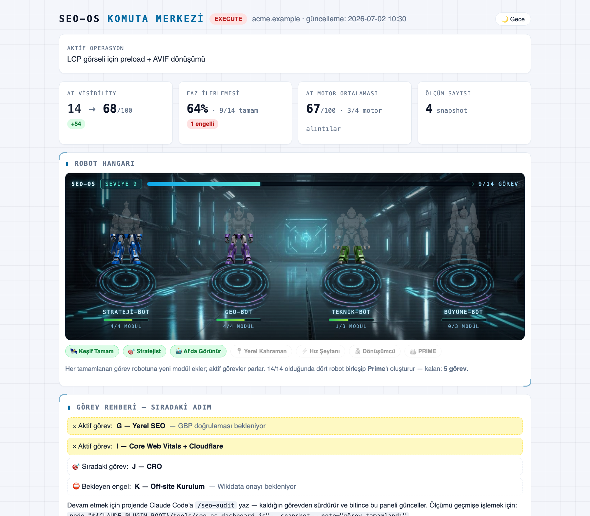
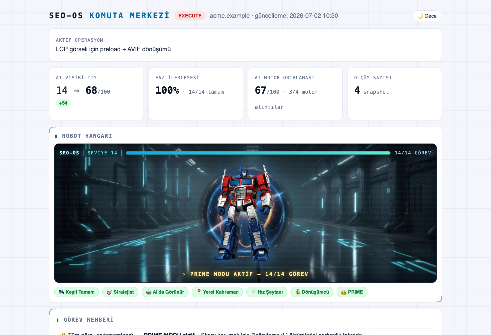

# Claude Web Toolkit

**English** · [Türkçe](./README.tr.md)

A site-agnostic **Growth Optimization Framework** — a collection of Claude Code plugins.
The goal isn't just "ranking higher on Google" or traffic; it's lifting a site to the top tier across
**Google + AI search engines (ChatGPT Search, Gemini, Perplexity, Claude, AI Overviews) + Core Web
Vitals + Knowledge Graph** to generate **more leads/sales**. It runs as Strategy → Search Visibility →
Performance → Growth. One repo, reused on every project/site.


*The Command Center panel (localhost:3928): four robot characters level up as audit tasks complete;
at 14/14 they merge into **Prime**.*

<details>
<summary>🏆 Prime finale (all 14 tasks completed)</summary>


</details>

## Capabilities (plugins)

| Plugin | What it does |
|--------|----------|
| **seo-geo-optimizer** | A 12-area audit: Business Goal · Competitor/Content Gap · Topical Authority · GEO · Entity/Knowledge Graph · Classic SEO · Local SEO · Crawlability · Core Web Vitals · CRO · Off-site · Validation. It **acts like a consultant**: detects the framework (+Cloudflare), asks questions, presents tasks one by one, does the code side, walks you through off-site steps (Search Console, GA4, Bing, target score), checks them off, and produces an **AI Visibility Score (0-100)**. |

> New capabilities are added under `plugins/` and registered in `.claude-plugin/marketplace.json`.

## Installation

### Method 1 — Add as a marketplace (recommended, reusable on every project)
```
/plugin marketplace add cinfikircom/claude-web-toolkit
/plugin install seo-geo-optimizer@claude-web-toolkit
```
After installation the `/seo-audit` command and the `seo-geo-audit` skill are ready in every project.

### Method 2 — Local testing (with the repo cloned)
```
/plugin marketplace add /path/to/claude-web-toolkit
/plugin install seo-geo-optimizer@claude-web-toolkit
```

## Usage
In any web project:
```
/seo-audit
```
or, to start from a specific area (12 areas):
`/seo-audit hedef · rakip · topical · geo · entity · seo · local · metadata · cwv · cro · setup · dogrula`
extras: `score` (AI Visibility Score) · `gate` (Release Readiness: PASS/FAIL) · `derin` (split into 4 agents) · `rapor`

**Command Center panel (game UI):** ask Claude to "start the panel" (or run
`node "$CLAUDE_PLUGIN_ROOT/tools/seo-os-dashboard.js" --serve --daemon --open`) →
a live game-style dashboard opens at **http://localhost:3928** (localhost-only): four robot
characters that level up as tasks complete, XP bar, quest log, achievements — and when all
14 tasks are done they merge into **Prime**. Manage with `--status` / `--stop`.
Feed it **real data**: `--measure --url=…` pulls Core Web Vitals from the PageSpeed Insights API
(incl. real-user INP from CrUX), and `tools/seo-os-probe.js` runs live queries against
Perplexity / ChatGPT Search / Gemini to measure whether your site is actually **cited** as a source.

Flow:
1. **Phase 0 — Interactive Discovery:** Claude detects the framework (+Cloudflare) and the current SEO/off-site
   state, asks business-goal/competitor/risk/off-site questions in chat, and produces `.seo-os/seo-kesif-raporu.md`
   + `.seo-os/seo-gorev-listesi.md` (a guided checklist) + an initial AI Visibility Score. (No code changes; all
   artifacts are collected in the `.seo-os/` folder.)
2. **Guided, area-by-area execution** — Strategy → Search Visibility → Performance → Growth → Off-site → Validation:
   A Business Goal → B Competitor → C Topical → D GEO → E Entity/KG → F SEO → G Local → H Crawlability → I CWV → J CRO →
   K Off-site → L Validation. Tasks are presented **one at a time**; each one: description + risk → **approval** →
   apply/delegate → check off in `.seo-os/seo-gorev-listesi.md` → next.

### Guided mode — Claude acts like a consultant
It doesn't just write code; **it has you do the things it can't.** Examples:
- Google Search Console membership + verification + `sitemap.xml` submission
- Bing Webmaster registration (DuckDuckGo/Yahoo use this index) + IndexNow
- Google Analytics 4 connection, Google Business Profile
- Measure on PageSpeed Insights / Pingdom / DebugBear → fix → loop **until the target score is reached**
- Favicon, image/CSS/JS optimization, H1-H6 hierarchy rules

### Deep mode — 4 expert agents
On large/comprehensive sites a single-pass audit can stay shallow. The work can be split across 4 expert agents:

| Agent | Areas | Focus |
|------|--------|------|
| `growth-strategy-agent` | A, B, C, J | Business goal, competitor/content gap, topical authority, CRO |
| `seo-geo-agent` | D, F, G, H | GEO/llms.txt, classic SEO, local SEO, crawlability |
| `entity-knowledge-graph-agent` | E | Entity, JSON-LD graph, Knowledge Graph, knowledge conflict |
| `performance-cwv-agent` | I | Core Web Vitals, Lighthouse, resource hints, Cloudflare |

Phase 0 runs in the main flow; areas are delegated to the relevant agent. **Memory:** each agent reads and
updates `.seo-os/seo-gorev-listesi.md` (context handoff) — no memory loss on transitions (details: SKILL.md "DEEP MODE").

### SEO-OS v2 — an "SEO Operating System"
The skill doesn't only offer suggestions; **it runs, writes state to disk, and progresses by mode.** (Runtime: `references/execution-model.md`.)
- **File-based state (SSOT):** `.seo-os/seo-os-state.json` is the project's single source of truth (read on boot, written on every action). `.seo-os/seo-gorev-listesi.md` is its human-readable view. All SEO-OS artifacts live in the `.seo-os/` folder — the project root stays clean.
- **3 execution modes:** **ANALYZE** (read-only) → **PROPOSE** (diff + risk, waits for approval) → **EXECUTE** (applies + writes state). No EXECUTE without approval.
- **Status:** `[ ]` Not Started · `[~]` In Progress · `[✓]` Completed · `[!]` Blocked/Waiting.
- A **deterministic dashboard** is rendered in every report:
```
=== SEO-OS DASHBOARD ===
FAZ 0A [~]   FAZ 0B [ ]
A [ ]  B [ ]  C [ ]   D [ ]  E [ ]  F [ ]
G [ ]  H [ ]  I [ ]   J [ ]  K [ ]  L [ ]
MODE: ANALYZE   CURRENT TASK: →   BLOCKED: → None   AI VISIBILITY: 0 → 0 / 100
========================
```
Rules: exactly one phase `[~]`, atomic progress, no transition without a state update, the approval gate is never skipped, nothing counts as `completed` until external integrations (GSC/sitemap/GA4) are verified. **Phase 0 has two rounds:** 0-A Tech Scan → 0-B Business Input.

### Ready-made generated artifacts
`/llms.txt`, `/llms-full.txt`, `/ai-agents.json`, an AI-friendly `robots.txt`, and per-page JSON-LD
schemas — produced by filling the templates under `skills/seo-geo-audit/templates/` with real data.

## Safety principles
- No code changes without approval.
- The framework is never swapped; only suggestions that fit the existing architecture.
- If the gain is below 5%, leave it untouched.
- Every change is presented with a Low/Medium/High risk label.

## Structure
```
claude-web-toolkit/
  .claude-plugin/marketplace.json
  .github/workflows/validate.yml    ← CI: syntax + JSON + version sync + golden regression (main site + fixtures)
  .github/workflows/agent-run.yml   ← manual trigger: E2E real-LLM run (claude -p, min-score gate)
  LICENSE  CONTRIBUTING.md  CHANGELOG.md
  seo-os-validation-suite/          ← benchmark: golden site + fixtures/ (e-commerce, multilingual, CF Pages)
                                       + scorer + harness/ + lighthouse-runner + delta-report
  plugins/seo-geo-optimizer/
    .claude-plugin/plugin.json
    commands/seo-audit.md
    tools/
      seo-os-tracker.js  seo-os-dashboard.js  seo-os-sync.js  README.md
    agents/
      growth-strategy-agent.md       seo-geo-agent.md
      entity-knowledge-graph-agent.md performance-cwv-agent.md
    skills/seo-geo-audit/
      SKILL.md
      references/
        execution-model.md       code-safety.md            business-goal.md
        competitor-content-gap.md
        topical-authority.md     geo-citation.md           entity-graph.md
        knowledge-conflict.md    schema-jsonld.md          eeat-quality-rater.md
        semantic-structure.md    ai-crawler-audit.md       crawl-budget.md
        local-seo.md             cloudflare-edge.md        core-web-vitals.md
        resource-hints.md        framework-performance.md  lighthouse-rubric.md
        llms-txt-generator.md    cro-audit.md              offsite-setup.md
        audit-tools.md           ai-visibility-score.md    release-gate.md
        sources.md
      templates/
        seo-os-state.template.json  kesif-raporu.template.md  gorev-listesi.template.md
        son-rapor.template.md       llms.txt.template         llms-full.txt.template
        ai-agents.json.template     robots-ai.txt.template
```

## Scope (12 areas)
**Strategy:** Business Goal & conversion prioritization · Competitor & content gap · Topical authority (pillar/cluster).
**Search visibility:** GEO (llms.txt/llms-full.txt/ai-agents.json, AI citation, chunking) · Entity SEO &
Knowledge Graph (JSON-LD `@graph`, Wikidata/`sameAs`, knowledge conflict, brand consistency) · Classic SEO
(metadata, H1-H6 & semantic HTML, E-E-A-T) · Local SEO (NAP, LocalBusiness, GBP) · Crawlability (AI crawler,
robots, crawl budget, Cloudflare bot). **Performance:** Core Web Vitals (LCP/INP/CLS/TTFB, resource hints,
Speculation Rules, Early Hints, Cloudflare edge: Polish/APO/Tiered Cache/Zaraz/Turnstile). **Growth:** CRO
(CTA, form, phone/WhatsApp). **Off-site:** Search Console, Bing/DuckDuckGo, GA4, Google Business.
**Validation:** PageSpeed, Pingdom, DebugBear, GTmetrix + **AI Visibility Score (0-100, fixed model `aivs/v1`)** +
**Release Readiness Gate** (`/seo-audit gate` → hard checks + score thresholds → PASS/FAIL).
On the entity side, a **Knowledge Conflict Detector**: brand identity is cross-compared across site + schema +
social + Wikidata, and conflicts are resolved with a "⚠ ENTITY CONFLICT DETECTED" report.

## License
[MIT](./LICENSE)
